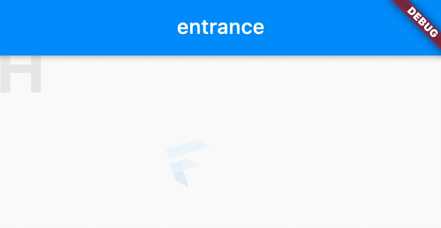

# montage

Organize your animations.

## Quickstart



```dart
// 1. Define your animations
const entrance = MontageAnimation(
  key: 'entrance',
  duration: Duration(seconds: 2), 
);

const exit = MontageAnimation(
  key: 'exit',
  duration: Duration(seconds: 2),
);

class Home extends StatefulWidget {
  const Home({
    Key? key,
  }) : super(key: key);

  @override
  _HomeState createState() => _HomeState();
}

class _HomeState extends State<Home> with TickerProviderStateMixin {
  MontageController? controller;

  @override
  void initState() {
    controller = MontageController(
      vsync: this,
      initialAnimation: entrance,
    );
    super.initState();
  }

  @override
  void dispose() {
    controller?.dispose();
    super.dispose();
  }

  @override
  Widget build(BuildContext context) {
    return Scaffold(
      appBar: AppBar(
        title: ValueListenableBuilder<MontageAnimation?>(
          valueListenable: controller!.current,
          builder: (context, current, child) => Text(current?.key ?? 'none'),
        ),
      ),
      // 2. Wrap your animated widget in a `Montage` with its controller.
      body: Montage( 
        controller: controller!,
        child: BasicScene(),
      ),
      floatingActionButton: FloatingActionButton.extended(
        onPressed: () {
          controller!.play([
            entrance,
            exit,
          ]);
        },
        label: Text('Play'),
        icon: Icon(Icons.video_call),
      ),
    );
  }
}


class BasicScene extends StatelessWidget {
  const BasicScene({
    Key? key,
  }) : super(key: key);
  @override
  Widget build(BuildContext context) {
    return Column(
      mainAxisSize: MainAxisSize.min,
      crossAxisAlignment: CrossAxisAlignment.center,
      children: [
        // 3. Use the motion widgets that defiens motions for each one of your animations
        Motion(
          motion: {
            // You can use the provider motions or custom ones
            entrance: Motions.combine([
              Motions.rotate(startTurns: -1, endTurns: 0),
              Motions.fadeIn,
            ]),
            exit: Motions.combine([
              Motions.rotate(startTurns: 0, endTurns: 1),
              Motions.fadeOut,
            ]),
          },
          child: FlutterLogo(
            size: 50,
          ),
        ),
        MotionText(
          text: 'Hello world',
          style: TextStyle(
            fontSize: 64,
            color: Colors.black,
            fontWeight: FontWeight.bold,
          ),
          characterMotion: {
            entrance: Motions.fadeFromTop(),
            exit: Motions.fadeToTop(),
          },
          reversedCharacterAnimation: [exit],
          wordMotion: {
            entrance: Motions.fadeIn,
            exit: Motions.fadeOut,
          },
        ),
      ],
    );
  }
}
```